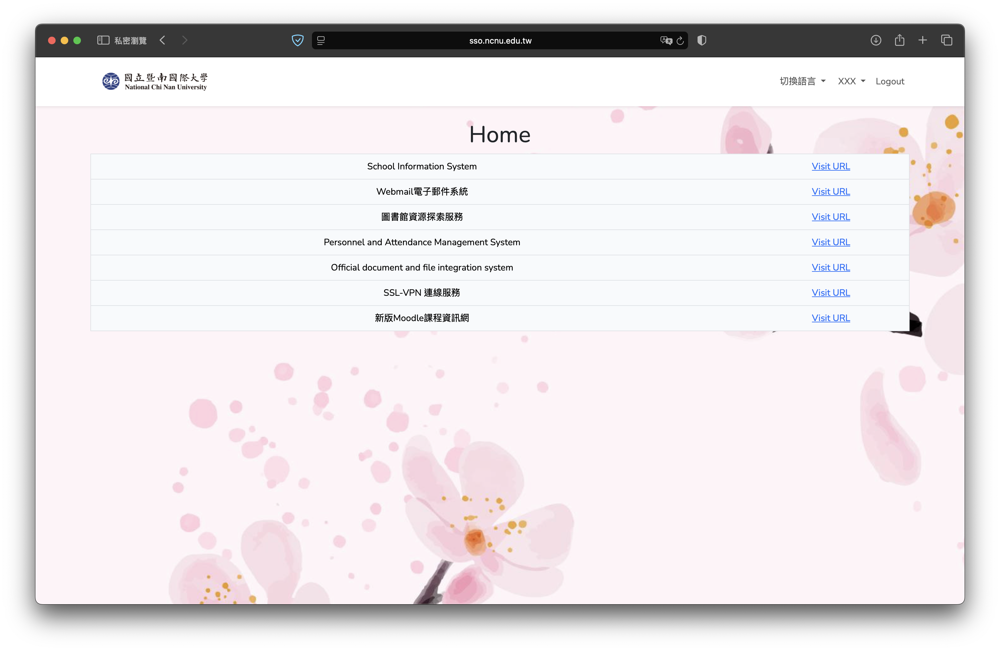
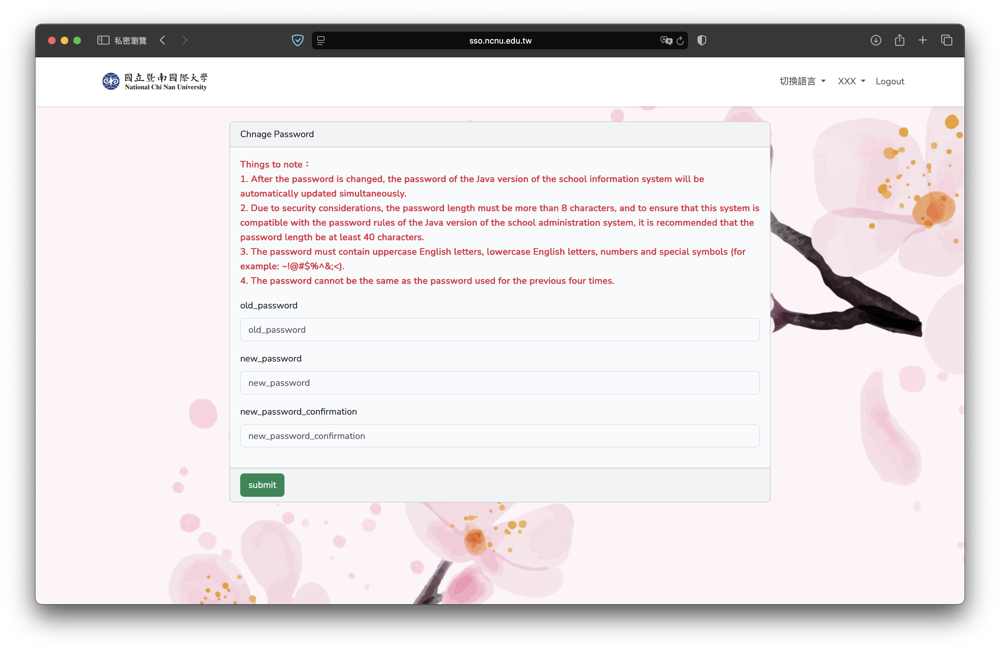
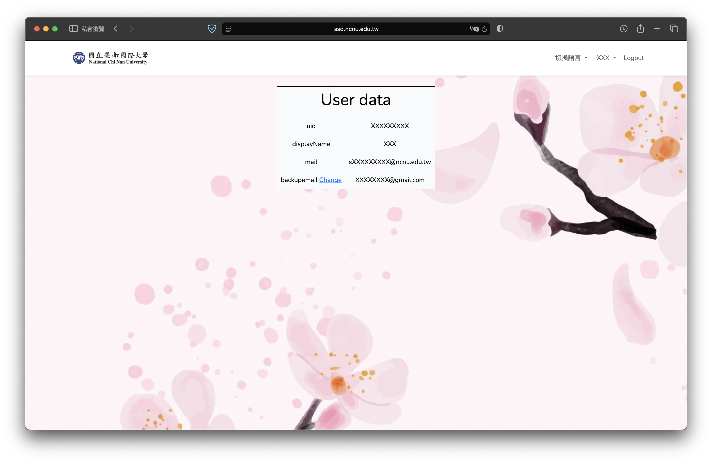
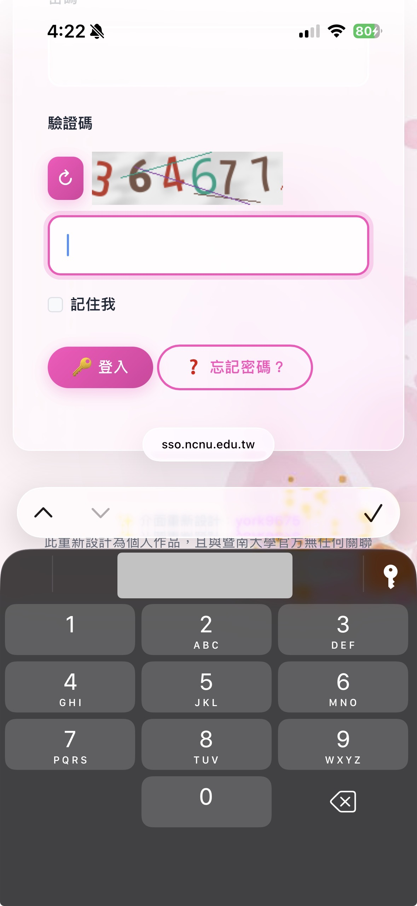
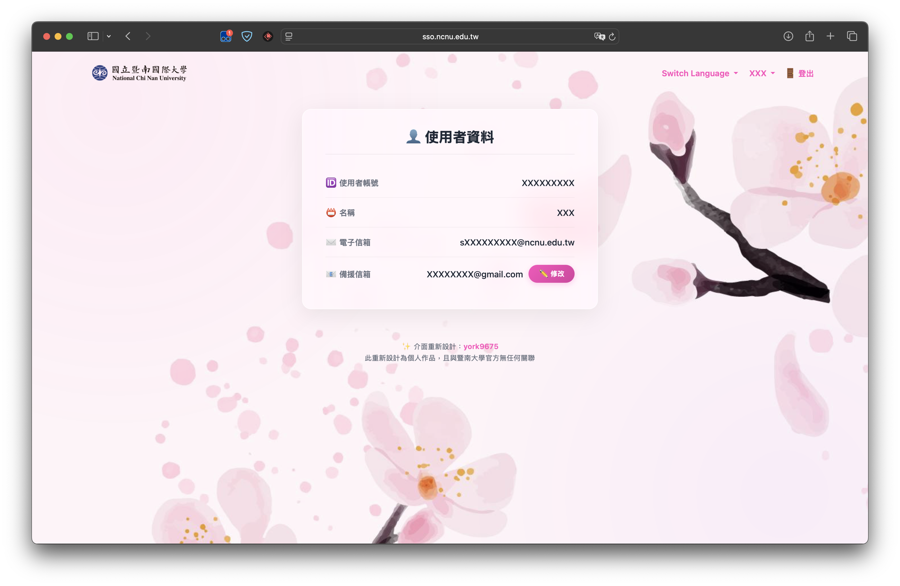
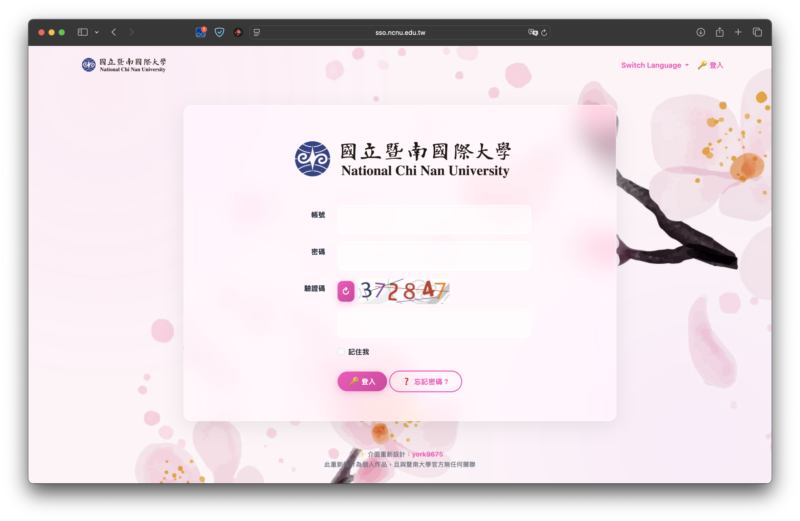
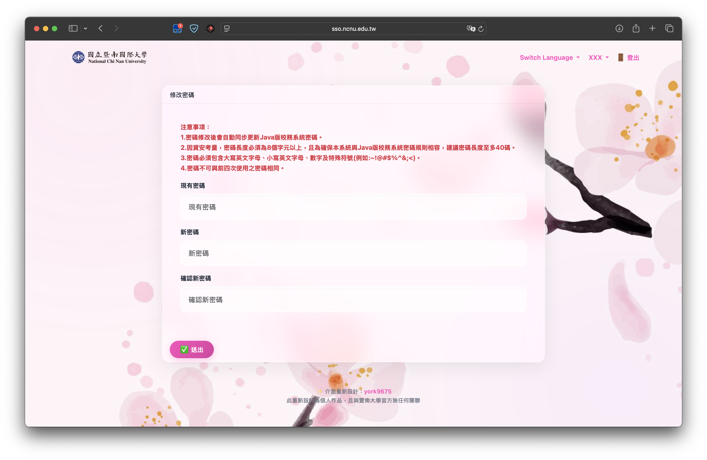

  
  
  
  

 
  🌐
  <b>繁體中文</B> 
  ·
  <a href="README_EN.md">English</a> 

---

## 簡介

**NCNU SSO Redesign** 是一個專為國立暨南國際大學單一登入平台 (SSO) 打造的全新 UI 介面腳本。

原版系統存在許多視覺與使用者體驗上的痛點，包含過時介面、手機版輸入驗證碼不便，以及對外籍生極不友善的破圖英文翻譯。本專案採用現代化的淺粉色玻璃擬物化 (Glassmorphism) 設計，並透過 JavaScript 深度重構了 DOM 結構與翻譯字典，全面提升暨大學生的日常登入體驗。

## 安裝指南

1. 在你的瀏覽器安裝 [Tampermonkey](https://www.tampermonkey.net/) 擴充功能（支援 Chrome, Edge, Safari, Firefox 等）。（也可使用其他支援 UserScript 的擴充功能，如 [Violentmonkey](https://violentmonkey.github.io/)）
2. 前往 **[👉 Greasy Fork 腳本頁面 👈](https://greasyfork.org/zh-TW/scripts/566962-ncnu-sso-重新設計)**，點擊綠色的「安裝此腳本」按鈕。
3. 開啟/重新整理 [暨大 SSO 登入頁面](https://sso.ncnu.edu.tw/)，享受全新的介面！

## 安全性聲明

> [!WARNING]\
> 因為這涉及全校師生的登入頁面，特此聲明：
> 
> 本專案為完全開源的前端樣式 (CSS) 與文本替換 (DOM Manipulation) 工具。**腳本絕不會攔截、收集、記錄或傳送任何帳號密碼及隱私資料**。所有的程式碼皆在你的本地端瀏覽器執行，請安心使用。你可以隨時檢閱原始碼。

---

## 核心亮點

  
<b>✨ 1. 現代化玻璃擬物 UI 與動態問候語</b>

  
  告別死板的白色背景！採用高質感的半透明模糊效果，配合平滑的動畫過渡，完美融入原版的櫻花背景。同時加入了動態問候語，會根據時間向你打招呼。

  

  
<b>🌐 2. 深度翻譯修復（友善外籍生）</b>

  
  原版系統在英文模式下仍會顯示大量中文，甚至在個人資料頁面直接暴露 `uid`、`displayName` 等原始鍵值。本腳本內建了完整的翻譯字典檔，自動替換所有破圖的文本與 placeholder。

  **改版前 (BEFORE):**
  
  
  

  
<b>📱 3. 驗證碼與手機版 UX 優化</b>

  
  重構了擁擠的驗證碼輸入區域，將圖片與重新整理按鈕移至頂部。更重要的是，現在在手機上點擊驗證碼框，會**直接喚起純數字大鍵盤**，大幅提升手機版登入效率！介面也全面加上了直覺的 Emoji 標籤。

  

  
<b>👤 4. 個人資料頁面重構</b>

  
  不再使用生硬、醜陋的 HTML Table。腳本會在背景自動將原版表格內的資料萃取出來，重新建構成一張排版精美、帶有專屬 Icon 的個人資訊卡片。

  

**✨ 5. 其他**

## 截圖

  
<b>展開查看更多截圖</b>

  
  
  
  

## 支持與贊助

如果你覺得這個專案讓你的校園生活變得更美觀、更順暢，歡迎給這個專案一顆 ⭐️！

這是我在課餘時間獨立開發維護的開源專案，如果這項工具對你有幫助，也歡迎透過下方按鈕請我喝杯咖啡，你的支持是我持續維護的最大動力！

  

（也接受 Line Pay Money、銀行轉帳，歡迎mail我！）

## Star History

***

© 2026 York Development

Made with :heart: in Taiwan.